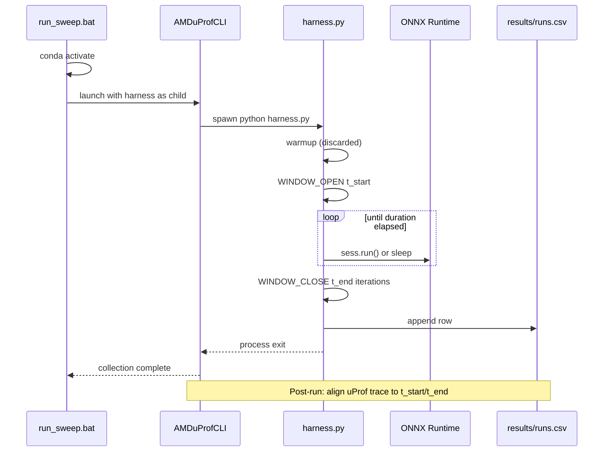

# Implementation Blueprint — Operator Energy Benchmarking Harness

**Status:** IMPLEMENTED — see `operators.py`, `harness.py`, `run_sweep.bat`, `BENCHMARK_WORKFLOW.md`.

**Revision:** 2026-06-05 (incorporates six reviewer adjustments — see §11)

**Authoritative specs:**
- `directives/measurement_harness_spec.md` (protocol wins on conflicts)
- `directives/operator_architecture_selection.md` (operator/cluster coverage)

**Platform:** AMD Ryzen AI 9 HX 370 · native Windows · CMD launch (not Cursor terminal for measured runs)

**Engines this phase:** Zen 5 CPU (`CPUExecutionProvider`) · Radeon 890M iGPU (`DmlExecutionProvider`)

**Headline metric:** energy per operator (Joules), from AMD uProf as a *separate process* — Python does not integrate power.

---

## 0. Design principle (from spec §0)

The Python harness does **not** measure energy. uProf does.

The harness only:
1. Drives a **clean, sustained, well-marked power window**
2. Logs exactly when that window opened/closed and how many iterations ran

Post-run alignment: `energy_per_op = (window_energy − idle_energy) / iterations`

Latency recorded by the loop is a cross-check, never the headline number.

---

## 1. Directory layout

```
benchmark/
  operators.py                  # registry + graph builders + one-time export
  harness.py                    # ONE shared measurement loop (all ops, engines, modes)
  run_sweep.bat                 # thin Windows CMD orchestrator (uProf parent-wraps harness)
  onnx_graphs/                  # <operator_name>[_<shape_idx>].onnx — Netron inspection
  results/
    runs.csv                    # one row per run (extended schema — §3.5)
    metadata.json               # session-level constants (ORT ver, VGM, thread count, …)
    upprof/                     # uProf output per run_id (post-alignment input)
  BENCHMARK_WORKFLOW.md         # user-facing CMD workflow guide
  IMPLEMENTATION_BLUEPRINT.md   # this file
```

**Explicit non-goals for v1:**
- No per-operator Python files
- No per-engine Python files
- No duplicate measurement loops
- No energy integration inside Python (beyond CSV placeholders and alignment markers)
- No multi-shape sweep execution (registry supports multiple shapes; v1 uses index 0 only)

**Spec update on implementation:** Update `directives/measurement_harness_spec.md` §1 and §7 (`run_sweep.ps1` → `run_sweep.bat`), dispatch baseline wording (Identity → non-elidable op), CSV schema extensions, and `INTRA_OP_NUM_THREADS = 12`.

---

## 2. `operators.py` — registry and ONNX graph factory

### 2.1 Registry schema (revised — multi-shape list)

Single dict `OPERATOR_REGISTRY` mapping **canonical snake_case name** → tuple:

```python
(name, build_fn, shape_profiles, dtype, cluster)
```

| Field | Meaning |
|---|---|
| `build_fn(onnx_path: Path, shape_profile: dict) -> dict` | Builds minimal single-operator ONNX graph at opset 20 for the given profile; writes `onnx_graphs/<name>.onnx` (v1) or `<name>_s<idx>.onnx` (future multi-shape); returns feed metadata |
| `shape_profiles` | **List** of shape-profile dicts (not a single hardcoded shape). v1 defaults to `shape_profiles[0]`. Future roofline/sensitivity sweeps iterate the list without schema changes. |
| `dtype` | `"float32"` for this phase |
| `cluster` | `"A"`, `"B1"`, or `"B2"` |

**Shape profile dict structure (per list element):**

```python
{
    "label": "vit_b16_default",          # human tag for CSV / filenames
    "input_shape": "12x197x64@12x64x197", # CSV string (operator-specific convention)
    "tensors": { ... },                   # concrete dims passed to build_fn
}
```

**v1 harness behavior:** `--shape-index` flag (default `0`) selects `shape_profiles[shape_index]`. No sweep loop in v1 — only the plumbing to add one later.

A `if __name__ == "__main__"` block exports every registry entry at index 0 (and optionally all indices with a `--all-shapes` flag for Netron inspection).

### 2.2 Build strategy

| Approach | When used |
|---|---|
| **PyTorch → `torch.onnx.export`** | Conv2D, Linear/GEMM, GELU, LayerNorm, GroupNorm, BatchNorm, AvgPool, depthwise conv, Add |
| **`onnx.helper` direct graph** | Batched `MatMul`, `Softmax`, or any op where export adds unwanted fusions |

**Rules:**
- Static shapes only (NPU path later)
- No dynamic axes in benchmark graphs
- Opset **20** everywhere
- Each graph: one primary compute node (+ constants if needed), explicit inputs/outputs
- Batched attention matmuls use 3D batch dimension `H=12` as the leading axis (realistic MHA scheduling)

### 2.3 Operator inventory (spec §10)

Global constants for attention-family profiles:
- **B** = 1 (single image)
- **H** = 12 heads (ViT-B/16)
- **N** = 197 tokens, **C** = 768, **head_dim** = 64

#### Cluster A — 8 operators

| Registry key | ONNX op(s) | Default shape profile `[0]` | Notes |
|---|---|---|---|
| `patch_embed_conv2d` | Conv | `[1,3,224,224]` → `[1,768,14,14]` | 16×16 kernel, stride 16 |
| `downsample_conv2d` | Conv | `[1,768,56,56]` → `[1,768,28,28]` | stride-2 downsampling |
| `ffn_gemm` | Gemm | `[197,768] @ [768,3072]` | FFN expansion (4×C) |
| `gelu` | Gelu | `[197,3072]` | post-FFN activation |
| `layer_norm` | LayerNormalization | `[197,768]` | ViT/XCiT/PvT |
| `group_norm` | GroupNorm | `[1,768,14,14]`, **`num_groups=1`** | PoolFormer spec: groups=1 → LayerNorm-over-channels behavior |
| `batch_norm` | BatchNormalization | `[1,256,56,56]` | EfficientFormer 4D |
| `residual_add` | Add | `[197,768]` + `[197,768]` | skip connection |

Each non-attention row has a `shape_profiles` list with one element today; additional profiles (e.g. smaller/larger N) can be appended later.

#### Cluster B1 — 6 operators

| Registry key | ONNX op(s) | Default shape profile `[0]` | Notes |
|---|---|---|---|
| `qkv_proj_gemm` | Gemm | `[197,768] @ [768,768]` | single projection |
| `attn_score_matmul` | MatMul | **`[12,197,64] @ [12,64,197]` → `[12,197,197]`** | batched multi-head QKᵀ |
| `xcit_cov_matmul` | MatMul | **`[12,64,197] @ [12,197,64]` → `[12,64,64]`** | batched multi-head cross-covariance |
| `softmax` | Softmax | `[12,197,197]`, axis=-1 | matches batched score tensor (logical companion to MHA matmuls) |
| `attn_value_matmul` | MatMul | **`[12,197,197] @ [12,197,64]` → `[12,197,64]`** | batched multi-head attention·V |
| `sra_conv2d` | Conv | `[1,768,56,56]` → `[1,768,7,7]` | PvT spatial reduction (~8×) |

#### Cluster B2 — 2 operators

| Registry key | ONNX op(s) | Default shape profile `[0]` | Notes |
|---|---|---|---|
| `avg_pool_token_mixer` | AveragePool | `[1,768,14,14]` → `[1,768,7,7]` | PoolFormer/EF pooling |
| `depthwise_conv2d` | Conv (groups=C) | `[1,768,14,14]`, 3×3 depthwise | XCiT LPI |

**Excluded from v1:** `shift`, `token_mixing_mlp` (enrichment only).

**Total: 16 registry entries** × 2 engines this phase.

### 2.4 Shared helpers inside `operators.py`

- `OPSET = 20`
- `ONNX_GRAPHS_DIR = Path(__file__).parent / "onnx_graphs"`
- `get_default_profile(name)` → `shape_profiles[0]`
- `make_feed_from_profile(profile)` — deterministic `numpy` inputs (fixed seed)
- `export_torch_module(...)` — shared export wrapper
- `build_dispatch_baseline_graph(path)` — minimal **non-elidable** graph for harness `--mode dispatch` (see §3.3); lives here or in harness, exported once to `onnx_graphs/dispatch_baseline.onnx`

### 2.5 Future multi-shape sweep (not v1 — structural readiness only)

```python
# Later: run_sweep.bat or a Python driver loops:
for shape_idx in range(len(shape_profiles)):
    harness.py --operator attn_score_matmul --shape-index shape_idx ...
```

No code-path duplication — only an extra loop variable.

---

## 3. `harness.py` — ONE shared measurement loop

### 3.1 CLI interface (argparse)

| Flag | Default | Purpose |
|---|---|---|
| `--operator` | required* | Registry key |
| `--engine` | required | `cpu` or `igpu` |
| `--duration` | `30` | Steady-state window seconds |
| `--warmup` | `5` | Discarded warm-up seconds |
| `--repeats` | `5` | Repeat count |
| `--device-id` | `0` | DML `device_id` |
| `--mode` | `measure` | `measure` \| `idle` \| `dispatch` |
| `--shape-index` | `0` | Select `shape_profiles[shape_index]` |
| `--outfile` | `results/runs.csv` | Append target |

\*For `--mode idle` / `dispatch`, `--operator` may be ignored.

### 3.2 Fixed session constants (logged every run + metadata header)

| Constant | Value | Where logged |
|---|---|---|
| `INTRA_OP_NUM_THREADS` | **`12`** (fixed) | stdout, `notes`, CSV column, `results/metadata.json` |
| `GRAPH_OPTIMIZATION_LEVEL` | **`ORT_ENABLE_ALL`** | stdout, `notes`, CSV column, `results/metadata.json` |
| `IGPU_VGM_MB` | **placeholder** — user records BIOS VGM allocation (e.g. `512`) | CSV column, `results/metadata.json`; workflow doc explains how to read/set |
| `OPSET` | `20` | CSV column |

**Metadata file (`results/metadata.json`):** written once per session (first harness invocation). Captures ORT version, uProf version (manual field), GPU driver version (manual/query), `INTRA_OP_NUM_THREADS`, `GRAPH_OPTIMIZATION_LEVEL`, `IGPU_VGM_MB`, opset, conda env name. Serves as the results header referenced in spec §8.

### 3.3 Session construction (engine branch)

**Shared (all modes that use ORT):**
```python
so = ort.SessionOptions()
so.graph_optimization_level = ort.GraphOptimizationLevel.ORT_ENABLE_ALL  # logged
so.intra_op_num_threads = INTRA_OP_NUM_THREADS  # = 12, logged
```

**CPU (`--engine cpu`):**
```python
providers = ["CPUExecutionProvider"]
```

**iGPU (`--engine igpu`) — mandatory DML options:**
```python
so.enable_mem_pattern = False
so.execution_mode = ort.ExecutionMode.ORT_SEQUENTIAL
providers = [("DmlExecutionProvider", {"device_id": device_id})]
```

**EP placement verification (repeat_idx 0 only):**
- `so.enable_profiling = True`
- Parse profiling JSON after first steady-state inference
- Confirm compute node on intended EP; CPU fallback → `notes`

### 3.4 Mode routing (same loop function for all modes)

| `--mode` | Behavior |
|---|---|
| `measure` | Load registry operator graph for `--shape-index`; `sess.run()` each iteration |
| `idle` | No ORT session; `time.sleep()` for warmup + window (identical markers/timing) |
| `dispatch` | Load **non-elidable dispatch baseline graph** (NOT `Identity`) — see below |

**Dispatch baseline (revised — § adjustment #3):**

`ORT_ENABLE_ALL` eliminates a bare `Identity` node during graph optimization, making the dispatch baseline measure nothing. Instead, `--mode dispatch` runs a minimal graph that survives optimization:

- **Planned op:** single element-wise `Add` on a tiny static tensor (e.g. `[1]` or `[1,1]`), OR a one-element `Relu`/`Gelu`
- **Requirement:** one non-fusable, non-elidable ORT node that still exercises session `run()` dispatch/launch overhead
- Exported to `onnx_graphs/dispatch_baseline.onnx` for Netron verification that the node survives `ORT_ENABLE_ALL`
- Operator CSV field: `operator=dispatch_baseline`, `cluster=` (empty or `baseline`)

### 3.5 CSV schema (extended from spec §9)

```
run_id, operator, cluster, engine, device_id, shape_index, input_shape, dtype, opset,
intra_op_num_threads, graph_optimization_level, igpu_vgm_mb,
repeat_idx, warmup_s, window_s, iterations_completed, wall_time_s, mean_latency_ms,
idle_power_w, active_power_w, window_energy_J, idle_energy_J,
energy_per_op_J, dispatch_energy_J, notes
```

| Filled by harness now | Left empty/NaN for post-uProf analysis |
|---|---|
| All identity/run-timing fields incl. `shape_index`, `intra_op_num_threads`, `graph_optimization_level`, `igpu_vgm_mb` (from constant/placeholder), `notes` | Energy/power columns |

`igpu_vgm_mb`: read from harness constant `IGPU_VGM_MB` (set at top of `harness.py` or env var `BENCHMARK_IGPU_VGM_MB`); workflow doc instructs user to set this to match BIOS before a session.

### 3.6 Measurement loop (unchanged structure)

Single function — warmup (discarded) → `WINDOW_OPEN` (`time.time()` epoch + `perf_counter`) → duration-based iteration loop → `WINDOW_CLOSE` → CSV append → cooldown.

### 3.7 Orchestrator interaction

`run_sweep.bat` passes `--repeats 1` per uProf-wrapped invocation. Harness supports `--repeats 5` for manual debugging without uProf.

### 3.8 What harness explicitly does NOT do

- Compute Joules from watt samples
- Duplicate loops per operator or engine
- Launch uProf (parent is `run_sweep.bat` / `AMDuProfCLI`)

---

## 4. `run_sweep.bat` — Windows CMD orchestrator

### 4.1 Top of file — conda activation

```bat
@echo off
setlocal EnableDelayedExpansion

call conda activate ryzen-ai-1.6.0
if errorlevel 1 (
    echo [FAIL] Could not activate conda environment.
    exit /b 1
)

cd /d "%~dp0"
```

### 4.2 Configuration block

```bat
set DURATION=30
set WARMUP=5
set REPEATS=5
set OUTFILE=results\runs.csv
set UPROF_CLI=AMDuProfCLI.exe
set IGPU_VGM_MB=512          REM EDIT: match BIOS Variable Graphics Memory setting
```

### 4.3 uProf parent-wrap pattern (revised — § adjustment #5)

**Do NOT** start uProf as a background/async process with separate START/STOP in CMD.

Instead, **`AMDuProfCLI` launches `python harness.py` as its child process.** uProf collection lifetime is bound to the harness process lifetime — clean process tree, no orphan collectors.

**Structural template (flags are TODO — verify on tower):**

```bat
REM ============================================================
REM TODO: UPROF FLAGS — DO NOT GUESS
REM Run on tower: AMDuProfCLI.exe timechart --help
REM Confirm syntax for: wrapping a child command, output path, metrics.
REM ============================================================

%UPROF_CLI% timechart ^
  REM ... verified flags ... ^
  --output results\upprof\!RUN_ID!.csv ^
  -- python harness.py ^
    --operator !OPERATOR! ^
    --engine !ENGINE! ^
    --duration %DURATION% ^
    --warmup %WARMUP% ^
    --repeats 1 ^
    --device-id 0 ^
    --mode measure ^
    --shape-index 0 ^
    --outfile %OUTFILE%
```

The `-- python harness.py ...` tail is the **child-process pattern** — exact uProf flag name for child launch (`--`, `/command`, etc.) to be filled from `AMDuProfCLI.exe --help`.

### 4.4 Per-(operator × engine × repeat) loop

```
FOR each operator in OPERATORS:
  FOR each engine in ENGINES:
    FOR repeat_idx = 0 .. REPEATS-1:
      set RUN_ID=!OPERATOR!_!ENGINE!_r!repeat_idx!_!timestamp!
      REM single uProf-wrapped harness invocation (no separate START/STOP)
      timeout /t 5 /nobreak   REM cooldown between repeats
```

### 4.5 Baseline invocations (commented templates)

Each baseline also uses the uProf parent-wrap pattern when run under uProf:

```bat
REM Idle baseline (per engine, per session):
%UPROF_CLI% timechart ... -- python harness.py --mode idle --engine cpu ...

REM Dispatch baseline (per engine, per session):
%UPROF_CLI% timechart ... -- python harness.py --mode dispatch --engine igpu ...
```

---

## 5. `BENCHMARK_WORKFLOW.md` — user-facing CMD guide

Sections (operational, no implementation code):

1. Prerequisites (conda, `onnxruntime-directml`, uProf, AC power, pinned power plan)
2. **BIOS VGM setup** — record Variable Graphics Memory allocation; set `IGPU_VGM_MB` / env var to match
3. One-time graph export (`python operators.py`) → Netron inspect `onnx_graphs/`
4. Verify dispatch baseline survives optimization (Netron: `dispatch_baseline.onnx` has visible Add/Relu node)
5. Smoke test without uProf
6. Baselines (`idle`, `dispatch`) per engine
7. Full sweep via `run_sweep.bat` from standalone CMD
8. Per-operator manual CMD examples (CPU vs iGPU, `--shape-index`)
9. NPU later (`--engine npu`)
10. Results alignment (`t_start`/`t_end` ↔ uProf), metadata.json, extended CSV columns
11. Troubleshooting (DML options, EP fallback, conda, uProf child-wrap syntax)

---

## 6. End-to-end data flow (revised uProf parent pattern)



---

## 7. Locked defaults

| Parameter | Value |
|---|---|
| Opset | 20 |
| Warm-up | 5 s (discarded) |
| Window | 30 s (duration-based) |
| Repeats | 5 per (operator × engine) |
| dtype | float32 |
| iGPU device_id | 0 |
| Engines (this phase) | `cpu`, `igpu` |
| MHA batching | B=1, H=12 heads on attention matmuls + softmax |
| `INTRA_OP_NUM_THREADS` | **12** (fixed) |
| `GRAPH_OPTIMIZATION_LEVEL` | **ORT_ENABLE_ALL** |
| Shape selection (v1) | `shape_profiles[0]` via `--shape-index 0` |
| ORT package | `onnxruntime-directml` |

---

## 8. Experimental controls

- Tower on AC; single pinned Windows power plan
- Close background apps; measured runs from clean standalone CMD
- Same ORT build for CPU and iGPU
- **`INTRA_OP_NUM_THREADS = 12` logged on every row**
- **`ORT_ENABLE_ALL` logged on every row**
- **VGM BIOS allocation recorded in metadata + CSV (`igpu_vgm_mb`)**
- Warm-up discarded every run
- Cooldown between repeats; flag throttling in `notes`
- Interleave run order recommended (op A cpu, op A igpu, …)

---

## 9. Open decisions (remaining)

| # | Question | Status |
|---|---|---|
| 1 | Conda env name | `ryzen-ai-1.6.0` — confirm |
| 2 | B2 enrichment (`shift`, `token_mixing_mlp`) | Excluded v1 |
| 3 | Dispatch baseline op choice | Single element-wise `Add` on `[1]` (preferred) — confirm or prefer `Relu` |
| 4 | `IGPU_VGM_MB` default in scripts | Placeholder `512` — user edits to match BIOS |
| 5 | uProf child-launch flag syntax | TODO on tower (`--help`) |
| 6 | Workflow doc path | `benchmark/BENCHMARK_WORKFLOW.md` |

**Resolved by adjustments:**
- ~~`INTRA_OP_NUM_THREADS`~~ → **12**
- ~~Single hardcoded shapes~~ → **list of `shape_profiles`, default index 0**
- ~~Identity dispatch baseline~~ → **non-elidable minimal op**
- ~~Async uProf START/STOP~~ → **parent-wrap child pattern**

---

## 10. Implementation order (after confirmation)

1. Create `benchmark/` directory structure + `results/upprof/`
2. Implement `operators.py` (multi-shape registry, batched MHA matmuls, `num_groups=1` GroupNorm) + export graphs
3. Implement `harness.py` (ORT_ENABLE_ALL, threads=12, dispatch baseline, extended CSV, metadata.json)
4. Implement `run_sweep.bat` (conda, uProf parent-wrap, nested loops)
5. Write `BENCHMARK_WORKFLOW.md` (VGM + CMD workflow)
6. Update `directives/measurement_harness_spec.md` to reflect all six adjustments

---

## 11. Changelog — six incorporated adjustments

| # | Adjustment | Where reflected |
|---|---|---|
| 1 | **Batched MHA matmuls** (B=1, H=12) | §2.3 `attn_score_matmul`, `attn_value_matmul`, `xcit_cov_matmul`; softmax aligned to `[12,197,197]` |
| 2 | **Parameterized registry shapes** (list per operator, default `[0]`) | §2.1 schema, `--shape-index` flag, §2.5 future sweep |
| 3 | **`ORT_ENABLE_ALL` logged**; **non-elidable dispatch baseline** (not Identity) | §3.2, §3.4, §2.4 `build_dispatch_baseline_graph` |
| 4 | **PoolFormer `group_norm`: `num_groups=1`** | §2.3 Cluster A table |
| 5 | **uProf parent-wrap** (`AMDuProfCLI` launches harness as child) | §4.3, §6 diagram; removed async START/STOP |
| 6 | **VGM + thread metadata** in CSV and session header | §3.2, §3.5 (`igpu_vgm_mb`, `intra_op_num_threads`, `graph_optimization_level`, `metadata.json`) |

---

*Revision 2026-06-05. Reply **confirm** (with any edits to §9) to begin implementation. No code files until confirmed.*
