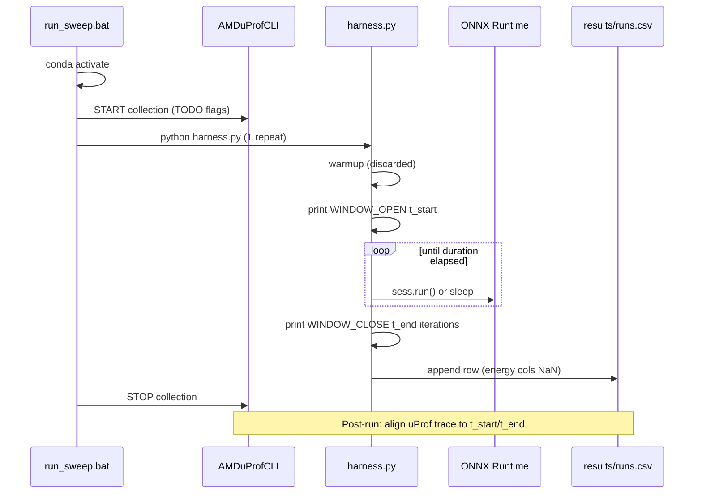

# Implementation Blueprint — Operator Energy Benchmarking Harness

**Status:** PLAN ONLY — awaiting final human confirmation before any code is written.

**Authoritative specs:**
- `measurement_harness_spec.md` (protocol wins on conflicts)
- `operator_architecture_selection.md` (operator/cluster coverage)

**Platform:** AMD Ryzen AI 9 HX 370 · native Windows · CMD launch (not Cursor terminal for measured runs)

**Engines this phase:** Zen 5 CPU (`CPUExecutionProvider`) · Radeon 890M iGPU (`DmlExecutionProvider`)

**Headline metric:** energy per operator (Joules), from AMD uProf as a *separate process* — Python does not integrate power.

---

## 0. Design principle (from spec §0)

The Python harness does **not** measure energy. uProf does.

The harness only:
1. Drives a **clean, sustained, well-marked power window**
2. Logs exactly when that window opened/closed and how many iterations ran

Post-run alignment: `energy_per_op = (window_energy − idle_energy) / iterations`

Latency recorded by the loop is a cross-check, never the headline number.

---

## 1. Directory layout

```
benchmark/
  operators.py              # registry + graph builders + one-time export
  harness.py                # ONE shared measurement loop (all ops, engines, modes)
  run_sweep.bat             # thin Windows CMD orchestrator (uProf brackets harness)
  onnx_graphs/              # <operator_name>.onnx — minimal single-op graphs (Netron)
  results/                  # CSV output, one row per run
  BENCHMARK_WORKFLOW.md     # user-facing CMD workflow guide
  IMPLEMENTATION_BLUEPRINT.md   # this file
```

**Explicit non-goals for v1:**
- No per-operator Python files
- No per-engine Python files
- No duplicate measurement loops
- No energy integration inside Python (beyond CSV placeholders and alignment markers)

**Spec update on implementation:** Change `measurement_harness_spec.md` §1 and §7 references from `run_sweep.ps1` → `run_sweep.bat`, and document CMD + conda activation as the canonical launch path.

---

## 2. `operators.py` — registry and ONNX graph factory

### 2.1 Registry schema

Single dict `OPERATOR_REGISTRY` mapping **canonical snake_case name** → tuple:

```python
(name, build_fn, input_shape, dtype, cluster)
```

| Field | Meaning |
|---|---|
| `build_fn(onnx_path: Path) -> dict` | Builds minimal single-operator ONNX graph at opset 20, writes `onnx_graphs/<name>.onnx`, returns feed metadata `{"input_name": ..., "feed": {...}}` |
| `input_shape` | Human-readable string for CSV (e.g. `"197x768"`, `"1x768x56x56"`) |
| `dtype` | `"float32"` for this phase |
| `cluster` | `"A"`, `"B1"`, or `"B2"` |

A `if __name__ == "__main__"` block (or `export_all_graphs()`) pre-exports every registry entry so graphs can be inspected in Netron before measuring.

### 2.2 Build strategy

| Approach | When used |
|---|---|
| **PyTorch → `torch.onnx.export`** | Conv2D, Linear/GEMM, GELU, LayerNorm, GroupNorm, BatchNorm, AvgPool, depthwise conv, Add |
| **`onnx.helper` direct graph** | Bare `MatMul`, `Softmax`, or any op where export adds unwanted fusions |

**Rules:**
- Static shapes only (NPU path later)
- No dynamic axes in benchmark graphs
- Opset **20** everywhere (DML EP ceiling; NPU/Vitis path alignment)
- Each graph: one compute node (+ constants if needed), explicit inputs/outputs

### 2.3 Operator inventory (spec §10)

Shapes anchored to five-model discussion in `PROJECT_CONTEXT.md` (ViT-B/16: N=197, C=768, head_dim=64; PvT stage geometry; XCiT cross-cov; EfficientFormer 4D stages).

#### Cluster A — 8 operators

| Registry key | ONNX op(s) | Representative shape | Notes |
|---|---|---|---|
| `patch_embed_conv2d` | Conv | input `[1,3,224,224]` → `[1,768,14,14]` | 16×16 kernel, stride 16 (ViT stem) |
| `downsample_conv2d` | Conv | `[1,768,56,56]` → `[1,768,28,28]` | stride-2 downsampling (PvT/EF) |
| `ffn_gemm` | Gemm/MatMul | `[197,768] @ [768,3072]` | FFN expansion (4×C) |
| `gelu` | Gelu | `[197,3072]` | post-FFN activation size |
| `layer_norm` | LayerNormalization | `[197,768]` | ViT/XCiT/PvT |
| `group_norm` | GroupNorm | `[1,768,14,14]`, groups=32 | PoolFormer 4D |
| `batch_norm` | BatchNormalization | `[1,256,56,56]` | EfficientFormer 4D |
| `residual_add` | Add | `[197,768]` + `[197,768]` | skip connection |

#### Cluster B1 — 6 operators

| Registry key | ONNX op(s) | Representative shape | Notes |
|---|---|---|---|
| `qkv_proj_gemm` | Gemm | `[197,768] @ [768,768]` | single Q/K/V/output projection |
| `attn_score_matmul` | MatMul | `[197,64] @ [64,197]` → `[197,197]` | ViT QKᵀ per head |
| `xcit_cov_matmul` | MatMul | `[64,197] @ [197,64]` → `[64,64]` | XCiT cross-covariance |
| `softmax` | Softmax | `[197,197]`, axis=-1 | attention normalization |
| `attn_value_matmul` | MatMul | `[197,197] @ [197,64]` | attention·V |
| `sra_conv2d` | Conv | `[1,768,56,56]` → `[1,768,7,7]` | PvT spatial reduction (~8×) on K/V path |

#### Cluster B2 — 2 operators

| Registry key | ONNX op(s) | Representative shape | Notes |
|---|---|---|---|
| `avg_pool_token_mixer` | AveragePool | `[1,768,14,14]` → `[1,768,7,7]` | PoolFormer/EF window pooling |
| `depthwise_conv2d` | Conv (groups=C) | `[1,768,14,14]`, 3×3 depthwise | XCiT LPI |

**Excluded from v1 (enrichment — spec §10):** `shift`, `token_mixing_mlp` — add only if explicitly approved.

**Total: 16 registry entries** × 2 engines this phase.

### 2.4 Shared helpers inside `operators.py`

- `OPSET = 20`
- `ONNX_GRAPHS_DIR = Path(__file__).parent / "onnx_graphs"`
- `make_feed_from_shape(...)` — deterministic `numpy` inputs (fixed seed)
- `export_torch_module(module, path, dummy_input, input_names)` — shared export wrapper
- `validate_graph(path)` — optional load check via ORT CPU EP at build time

---

## 3. `harness.py` — ONE shared measurement loop

### 3.1 CLI interface (argparse)

| Flag | Default | Purpose |
|---|---|---|
| `--operator` | required* | Registry key |
| `--engine` | required | `cpu` or `igpu` |
| `--duration` | `30` | Steady-state window seconds (spec §5) |
| `--warmup` | `5` | Discarded warm-up seconds (spec §4) |
| `--repeats` | `5` | Repeat count (see §3.6 for orchestrator interaction) |
| `--device-id` | `0` | DML `device_id` (890M = 0) |
| `--mode` | `measure` | `measure` \| `idle` \| `dispatch` |
| `--outfile` | `results/runs.csv` | Append target |

\*For `--mode idle` / `dispatch`, `--operator` may be ignored or set to a pseudo-name.

**Logged constants every run:**
- `INTRA_OP_NUM_THREADS` — fixed integer, documented constant across all runs
- `OPSET = 20`

### 3.2 Session construction (engine branch)

**CPU:**
```python
so = ort.SessionOptions()
so.intra_op_num_threads = INTRA_OP_NUM_THREADS  # fixed, logged
providers = ["CPUExecutionProvider"]
```

**iGPU (mandatory — spec §3):**
```python
so = ort.SessionOptions()
so.enable_mem_pattern = False                       # required by DML EP
so.execution_mode = ort.ExecutionMode.ORT_SEQUENTIAL  # required by DML EP
providers = [("DmlExecutionProvider", {"device_id": device_id})]
```

**EP placement verification (first run per invocation):**
- `so.enable_profiling = True` on repeat_idx 0
- After first steady-state inference, read profiling JSON
- Check compute node landed on intended EP (not silent CPU fallback)
- CPU fallback → recorded in `notes` column

### 3.3 Mode routing (same loop function for all modes)

| `--mode` | Behavior |
|---|---|
| `measure` | Load registry operator graph; `sess.run()` each iteration |
| `idle` | No ORT session; `time.sleep()` for warmup + window (identical markers/timing) |
| `dispatch` | Minimal `Identity` ONNX graph; same `sess.run()` loop — dispatch floor baseline (spec §6) |

### 3.4 Measurement loop (single function — no copies)

```
for repeat_idx in range(repeats):
    run_id = f"{operator}_{engine}_r{repeat_idx}_{timestamp}"

    # --- WARMUP (discarded) ---
    warmup_deadline = perf_counter() + warmup_s
    while perf_counter() < warmup_deadline:
        execute_one()   # sess.run() or sleep chunk

    # --- OPEN WINDOW ---
    t_start = time.time()          # epoch — uProf alignment
    pc_start = perf_counter()
    print/log: "[WINDOW_OPEN] run_id=... t_start=... engine=... mode=..."

    iterations = 0
    pc_deadline = perf_counter() + duration_s
    while perf_counter() < pc_deadline:
        execute_one()
        iterations += 1

    # --- CLOSE WINDOW ---
    t_end = time.time()
    wall_time_s = perf_counter() - pc_start
    mean_latency_ms = (wall_time_s / iterations) * 1000
    print/log: "[WINDOW_CLOSE] run_id=... t_end=... iterations=..."

    append_csv_row(schema §9)
    sleep(3-5 s)   # cooldown between repeats
```

**Duration-based only** — never a fixed iteration count. Iteration count is an *output*.

### 3.5 CSV schema (spec §9)

Harness appends one row per repeat:

```
run_id, operator, cluster, engine, device_id, input_shape, dtype, opset,
repeat_idx, warmup_s, window_s, iterations_completed, wall_time_s, mean_latency_ms,
idle_power_w, active_power_w, window_energy_J, idle_energy_J,
energy_per_op_J, dispatch_energy_J, notes
```

| Filled by harness now | Left empty/NaN for post-uProf analysis |
|---|---|
| `run_id`, `operator`, `cluster`, `engine`, `device_id`, `input_shape`, `dtype`, `opset`, `repeat_idx`, `warmup_s`, `window_s`, `iterations_completed`, `wall_time_s`, `mean_latency_ms`, `notes` | `idle_power_w`, `active_power_w`, `window_energy_J`, `idle_energy_J`, `energy_per_op_J`, `dispatch_energy_J` |

First write creates CSV with header if missing.

### 3.6 Orchestrator interaction

`run_sweep.bat` owns the outer repeat loop and passes `--repeats 1` per uProf bracket so each repeat gets its own energy trace and `run_id`.

Harness still supports `--repeats 5` for manual single-op debugging without uProf.

### 3.7 What harness explicitly does NOT do

- Start/stop uProf
- Compute Joules from watt samples
- Duplicate loops per operator or engine

---

## 4. `run_sweep.bat` — Windows CMD orchestrator

> **Critical change from original spec:** orchestrator is a **Batch script**, not PowerShell. Conda activation at the top before any Python commands.

### 4.1 Top of file — conda activation

```bat
@echo off
setlocal EnableDelayedExpansion

REM === EDIT THIS to match your environment name ===
call conda activate ryzen-ai-1.6.0
if errorlevel 1 (
    echo [FAIL] Could not activate conda environment.
    exit /b 1
)

cd /d "%~dp0"
```

### 4.2 Configuration block

```bat
set DURATION=30
set WARMUP=5
set REPEATS=5
set OUTFILE=results\runs.csv
set UPROF_CLI=AMDuProfCLI.exe
```

Operator list: hardcoded 16 registry keys, or generated via `python -c "from operators import ..."`.

Engine list: `cpu igpu`.

### 4.3 Per-(operator × engine × repeat) sequence

```
FOR each operator in OPERATORS:
  FOR each engine in ENGINES:
    FOR repeat_idx = 0 .. REPEATS-1:

      set RUN_ID=%operator%_%engine%_r%repeat_idx%_%timestamp%

      REM === TODO: uProf START — verify flags against installed uProf 5.x ===
      REM AMDuProfCLI.exe timechart ... --duration (warmup+duration+margin) ...
      REM Output: results\upprof\%RUN_ID%.csv

      python harness.py ^
        --operator %operator% ^
        --engine %engine% ^
        --duration %DURATION% ^
        --warmup %WARMUP% ^
        --repeats 1 ^
        --device-id 0 ^
        --mode measure ^
        --outfile %OUTFILE%

      REM === TODO: uProf STOP / finalize collection ===

      timeout /t 5 /nobreak
```

### 4.4 Baseline sweeps (commented templates — not auto-run in full sweep)

**Idle baseline** (once per engine per session):
```bat
python harness.py --mode idle --engine cpu --duration 30 --warmup 5 --repeats 1 --outfile results\runs.csv
```

**Dispatch baseline** (once per engine per session):
```bat
python harness.py --mode dispatch --engine igpu --duration 30 --warmup 5 --repeats 1 --outfile results\runs.csv
```

Energy subtraction happens in analysis, not inside the sweep loop.

### 4.5 uProf TODO block (no guessed flags)

```bat
REM ============================================================
REM TODO: UPROF FLAGS — DO NOT GUESS
REM On the HX 370 tower, run:
REM   AMDuProfCLI.exe timechart --help
REM   AMDuProfCLI.exe power --help
REM Verify: collection duration brackets (warmup + window + margin),
REM          output CSV path, package/SoC power metric, sampling interval.
REM Replace the START/STOP stubs below with verified 5.x syntax.
REM ============================================================
```

---

## 5. `BENCHMARK_WORKFLOW.md` — user-facing CMD guide

Operational guide (no implementation code). Sections:

1. **Prerequisites** — conda env, `onnxruntime-directml`, uProf on PATH, AC power, pinned Windows power plan
2. **One-time graph export** — `cd benchmark && python operators.py` → inspect `onnx_graphs/*.onnx` in Netron
3. **Smoke test (no uProf)** — single operator, both engines
4. **Baselines** — when/how to run `idle` and `dispatch` per engine
5. **Full sweep** — `run_sweep.bat` from standalone CMD (close IDE/background apps first — spec §8)
6. **Per-operator manual runs** — CMD examples for CPU vs iGPU
7. **NPU later** — add `--engine npu` + Vitis EP; same harness, new provider branch
8. **Results** — CSV location, `t_start`/`t_end` alignment to uProf, post-hoc energy columns
9. **Troubleshooting** — DML errors, EP fallback in `notes`, conda activation failures

---

## 6. End-to-end data flow



---

## 7. Locked defaults (spec-aligned)

| Parameter | Value |
|---|---|
| Opset | 20 |
| Warm-up | 5 s (discarded) |
| Window | 30 s (duration-based) |
| Repeats | 5 per (operator × engine) |
| dtype | float32 |
| iGPU device_id | 0 |
| Engines (this phase) | `cpu`, `igpu` |
| ORT package | `onnxruntime-directml` (single env for CPU + iGPU) |

---

## 8. Experimental controls (spec §8 — workflow doc will checklist)

- Tower on AC; single pinned Windows power plan
- Close background apps; measured runs from clean standalone CMD (not Cursor terminal)
- Same ORT build for CPU and iGPU
- Fixed `intra_op_num_threads`, logged
- Warm-up discarded every run
- Cooldown between repeats; flag throttled windows in `notes`
- Consider interleaving run order (op A cpu, op A igpu, op B cpu …)

---

## 9. Open decisions (confirm before coding)

| # | Question | Proposed default |
|---|---|---|
| 1 | Conda env name in `run_sweep.bat` | `ryzen-ai-1.6.0` |
| 2 | Characteristic shapes (§2.3 table) | As listed — any changes? |
| 3 | B2 enrichment (`shift`, `token_mixing_mlp`) | Excluded from v1 |
| 4 | `INTRA_OP_NUM_THREADS` | Pin to physical core count (logged) — or specify a number? |
| 5 | Repeat ownership | Outer loop in `.bat` with `--repeats 1` per uProf bracket |
| 6 | Workflow doc path | `benchmark/BENCHMARK_WORKFLOW.md` |

---

## 10. Implementation order (after confirmation)

1. Create `benchmark/` directory structure
2. Implement `operators.py` + export all 16 graphs to `onnx_graphs/`
3. Implement `harness.py` (single loop, all modes, CSV append)
4. Implement `run_sweep.bat` (conda activate, nested loops, uProf TODO stubs)
5. Write `BENCHMARK_WORKFLOW.md`
6. Update `measurement_harness_spec.md` (ps1 → bat, any default changes)

---

*Generated 2026-06-05. Review with other LLMs, then reply **confirm** (with any edits) to begin implementation.*
